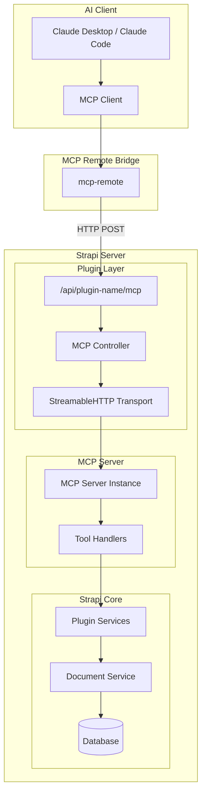
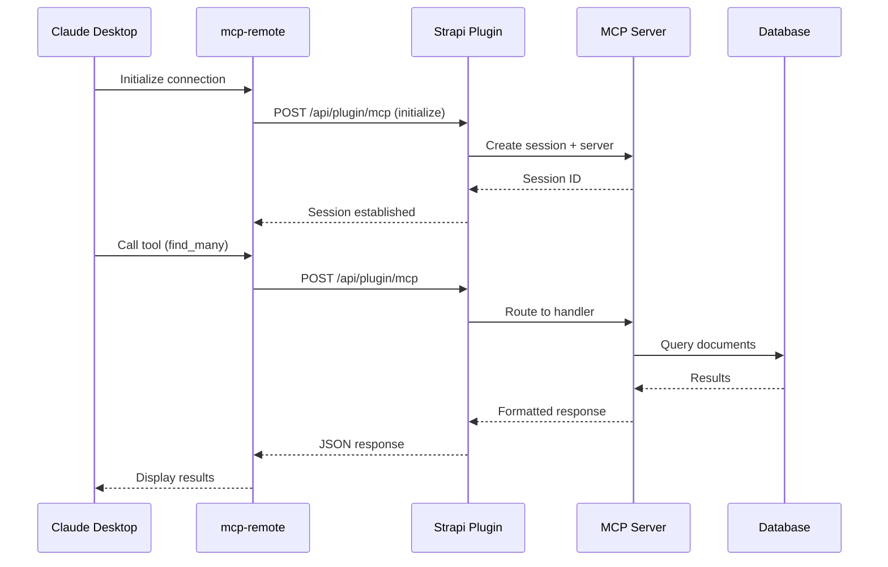
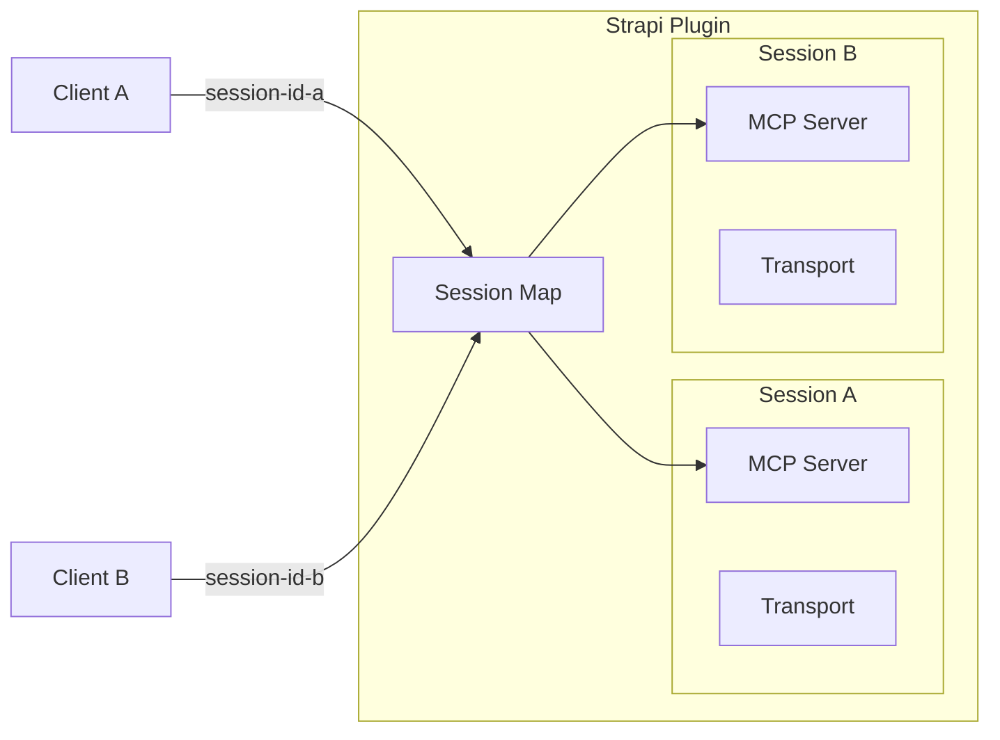
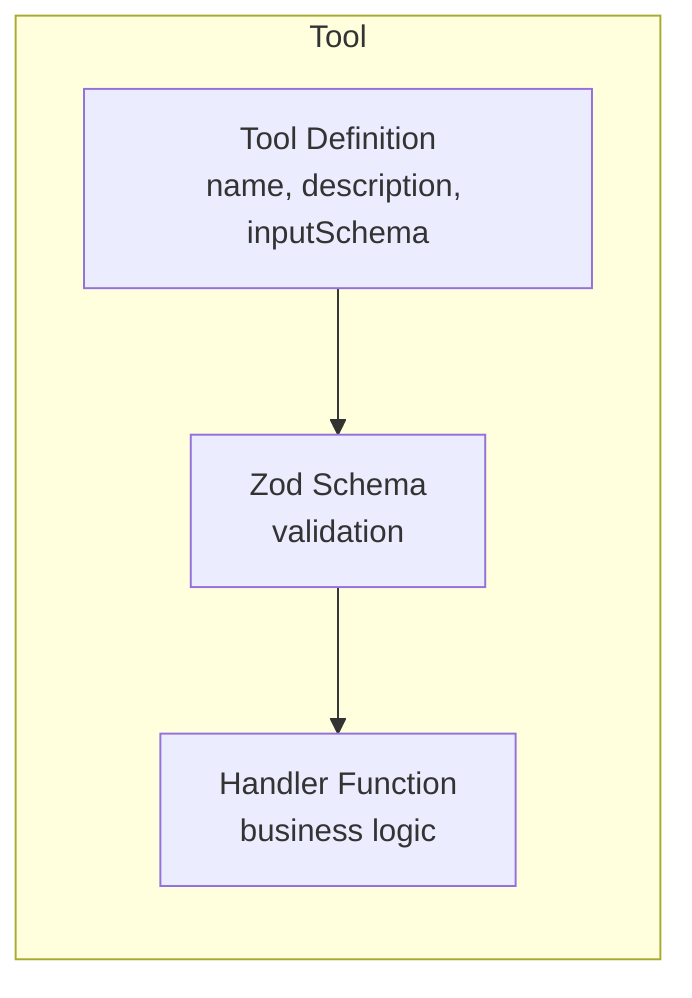

# Building MCP Plugins for Strapi: A Comprehensive Guide

Learn how to create Model Context Protocol (MCP) plugins for Strapi v5, enabling AI assistants like Claude to interact directly with your CMS content.

---

## Table of Contents

1. [Introduction](#introduction)
2. [Architecture Overview](#architecture-overview)
3. [Plugin Structure](#plugin-structure)
4. [Step-by-Step Guide](#step-by-step-guide)
5. [Building Tools](#building-tools)
6. [Best Practices](#best-practices)
7. [Real-World Examples](#real-world-examples)
8. [Deployment](#deployment)
9. [Conclusion](#conclusion)

---

## Introduction

### What is MCP?

The **Model Context Protocol (MCP)** is an open standard introduced by Anthropic that enables seamless integration between AI applications and external data sources. Think of it as a universal adapter that allows AI assistants to interact with your systems through a standardized interface.

### Why Strapi + MCP?

Strapi is a powerful headless CMS that manages your content. By combining Strapi with MCP, you enable AI assistants to:

- **Query content** - Search and retrieve articles, products, or any content type
- **Create and update** - AI can draft content directly into your CMS
- **Manage media** - Upload and organize assets
- **Access structured data** - Leverage your existing content models

This guide is based on real-world plugins we've built:
- `strapi-content-mcp` - Generic content access for any Strapi instance
- `yt-transcript-strapi-plugin` - YouTube transcript management with AI-readable formats
- `octalens-mentions` - Social mentions tracking and analysis

---

## Architecture Overview

### High-Level Architecture



### Request Flow



### Session Management

Each client connection creates an isolated session with its own MCP server instance:



---

## Plugin Structure

A Strapi MCP plugin follows this directory structure:

```
my-mcp-plugin/
├── admin/
│   └── src/
│       └── index.ts              # Admin panel integration (optional)
├── server/
│   └── src/
│       ├── index.ts              # Plugin entry point
│       ├── register.ts           # Register phase
│       ├── bootstrap.ts          # Bootstrap phase (MCP init)
│       ├── destroy.ts            # Cleanup
│       ├── config/
│       │   └── index.ts          # Plugin configuration
│       ├── controllers/
│       │   ├── index.ts
│       │   └── mcp.ts            # MCP request handler
│       ├── routes/
│       │   ├── index.ts
│       │   └── content-api.ts    # MCP endpoint routes
│       ├── services/
│       │   └── index.ts          # Business logic
│       └── mcp/
│           ├── index.ts          # MCP exports
│           ├── server.ts         # MCP server factory
│           ├── schemas/
│           │   └── index.ts      # Zod validation schemas
│           ├── tools/
│           │   ├── index.ts      # Tool registry
│           │   ├── find-many.ts  # Individual tools
│           │   └── ...
│           └── utils/
│               └── sanitize.ts   # Helper utilities
├── package.json
└── tsconfig.json
```

---

## Step-by-Step Guide

### Step 1: Create the Plugin Scaffold

Use the Strapi SDK to create a new plugin:

```bash
npx @strapi/sdk-plugin init my-mcp-plugin
cd my-mcp-plugin
```

### Step 2: Install Dependencies

Add the MCP SDK and validation library:

```bash
npm install @modelcontextprotocol/sdk zod
```

Update `package.json` to bundle these dependencies:

```json
{
  "dependencies": {
    "@modelcontextprotocol/sdk": "^1.12.0",
    "zod": "^4.0.0"
  },
  "bundledDependencies": [
    "@modelcontextprotocol/sdk",
    "zod"
  ]
}
```

### Step 3: Create the MCP Server Factory

Create `server/src/mcp/server.ts`:

```typescript
import type { Core } from '@strapi/strapi';
import { Server } from '@modelcontextprotocol/sdk/server/index.js';
import {
  CallToolRequestSchema,
  ListToolsRequestSchema,
} from '@modelcontextprotocol/sdk/types.js';
import { tools, handleToolCall } from './tools';

/**
 * Create an MCP server instance configured with your tools
 */
export function createMcpServer(strapi: Core.Strapi): Server {
  const server = new Server(
    {
      name: 'my-mcp-plugin',
      version: '1.0.0',
    },
    {
      capabilities: {
        tools: {},
      },
    }
  );

  // Register handler for listing available tools
  server.setRequestHandler(ListToolsRequestSchema, async () => {
    strapi.log.debug('[my-mcp-plugin] Listing tools');
    return { tools };
  });

  // Register handler for tool calls
  server.setRequestHandler(CallToolRequestSchema, async (request) => {
    strapi.log.debug(`[my-mcp-plugin] Tool call: ${request.params.name}`);
    return handleToolCall(strapi, request);
  });

  strapi.log.info('[my-mcp-plugin] MCP server created with tools:', {
    tools: tools.map((t) => t.name),
  });

  return server;
}
```

### Step 4: Create the MCP Controller

Create `server/src/controllers/mcp.ts`:

```typescript
import type { Core } from '@strapi/strapi';
import { randomUUID } from 'node:crypto';
import { StreamableHTTPServerTransport } from '@modelcontextprotocol/sdk/server/streamableHttp.js';

const mcpController = ({ strapi }: { strapi: Core.Strapi }) => ({
  /**
   * Handle MCP requests (POST, GET, DELETE)
   * Creates a new server+transport per session for proper isolation
   */
  async handle(ctx: any) {
    const plugin = strapi.plugin('my-mcp-plugin') as any;

    if (!plugin.createMcpServer) {
      ctx.status = 503;
      ctx.body = {
        error: 'MCP plugin not initialized',
        message: 'The MCP plugin is not available.',
      };
      return;
    }

    try {
      // Get or create session based on session ID header
      const sessionId = ctx.request.headers['mcp-session-id'] || randomUUID();
      let session = plugin.sessions.get(sessionId);

      if (!session) {
        // Create new server and transport for this session
        const server = plugin.createMcpServer();
        const transport = new StreamableHTTPServerTransport({
          sessionIdGenerator: () => sessionId,
        });

        await server.connect(transport);

        session = { server, transport, createdAt: Date.now() };
        plugin.sessions.set(sessionId, session);

        strapi.log.debug(`[my-mcp-plugin] New session created: ${sessionId}`);
      }

      // Handle the request
      await session.transport.handleRequest(ctx.req, ctx.res, ctx.request.body);

      // Prevent Koa from handling response
      ctx.respond = false;
    } catch (error) {
      strapi.log.error('[my-mcp-plugin] Error handling MCP request', {
        error: error instanceof Error ? error.message : String(error),
      });

      if (!ctx.res.headersSent) {
        ctx.status = 500;
        ctx.body = {
          error: 'MCP request failed',
          message: error instanceof Error ? error.message : 'Unknown error',
        };
      }
    }
  },
});

export default mcpController;
```

### Step 5: Set Up Routes

Create `server/src/routes/content-api.ts`:

```typescript
export default [
  {
    method: 'POST',
    path: '/mcp',
    handler: 'mcp.handle',
    config: {
      policies: [],
      auth: false, // Set to true or add policies for authentication
    },
  },
  {
    method: 'GET',
    path: '/mcp',
    handler: 'mcp.handle',
    config: {
      policies: [],
      auth: false,
    },
  },
  {
    method: 'DELETE',
    path: '/mcp',
    handler: 'mcp.handle',
    config: {
      policies: [],
      auth: false,
    },
  },
];
```

### Step 6: Initialize in Bootstrap

Create `server/src/bootstrap.ts`:

```typescript
import type { Core } from '@strapi/strapi';
import { createMcpServer } from './mcp/server';

const bootstrap = async ({ strapi }: { strapi: Core.Strapi }) => {
  const config = strapi.config.get('plugin.my-mcp-plugin', { enabled: true });

  if (!config.enabled) {
    strapi.log.info('[my-mcp-plugin] Plugin disabled by configuration');
    return;
  }

  // Store the server factory function
  const plugin = strapi.plugin('my-mcp-plugin') as any;
  plugin.createMcpServer = () => createMcpServer(strapi);
  plugin.sessions = new Map(); // Track active sessions

  strapi.log.info('[my-mcp-plugin] MCP plugin initialized');
  strapi.log.info('[my-mcp-plugin] Endpoint: /api/my-mcp-plugin/mcp');
};

export default bootstrap;
```

---

## Building Tools

### Tool Anatomy

Each tool consists of three parts:



### Step 1: Define the Tool Schema

Create `server/src/mcp/schemas/index.ts`:

```typescript
import { z } from 'zod';

// Schema for your tool
export const FindItemsSchema = z.object({
  query: z.string().optional(),
  page: z.number().int().min(1).optional().default(1),
  pageSize: z.number().int().min(1).max(100).optional().default(25),
  includeContent: z.boolean().optional().default(false),
});

export type FindItemsInput = z.infer<typeof FindItemsSchema>;

// Schema registry
export const ToolSchemas = {
  find_items: FindItemsSchema,
} as const;

type ToolName = keyof typeof ToolSchemas;

// Validation helper
export function validateToolInput<T extends ToolName>(
  toolName: T,
  input: unknown
): z.infer<(typeof ToolSchemas)[T]> {
  const schema = ToolSchemas[toolName];
  const result = schema.safeParse(input);

  if (!result.success) {
    const errorMessages = result.error.issues.map((err) => {
      const path = err.path.length > 0 ? `${err.path.join('.')}: ` : '';
      return `${path}${err.message}`;
    });
    throw new Error(`Validation failed:\n${errorMessages.join('\n')}`);
  }

  return result.data as z.infer<(typeof ToolSchemas)[T]>;
}
```

### Step 2: Create the Tool Handler

Create `server/src/mcp/tools/find-items.ts`:

```typescript
import type { Core } from '@strapi/strapi';
import { validateToolInput } from '../schemas';

// Tool definition (exposed to AI)
export const findItemsTool = {
  name: 'find_items',
  description:
    'Search for items in the database. Returns paginated results with optional content.',
  inputSchema: {
    type: 'object' as const,
    properties: {
      query: {
        type: 'string',
        description: 'Search query to filter results',
      },
      page: {
        type: 'number',
        description: 'Page number (starts at 1)',
        default: 1,
      },
      pageSize: {
        type: 'number',
        description: 'Items per page (max 100)',
        default: 25,
      },
      includeContent: {
        type: 'boolean',
        description: 'Include full content in results. Default: false',
      },
    },
    required: [],
  },
};

// Handler function
export async function handleFindItems(strapi: Core.Strapi, args: unknown) {
  // Validate input
  const { query, page, pageSize, includeContent } = validateToolInput('find_items', args);

  const start = (page - 1) * pageSize;

  // Build filters
  const filters: Record<string, any> = {};
  if (query) {
    filters.$or = [
      { title: { $containsi: query } },
      { description: { $containsi: query } },
    ];
  }

  // Query database
  const items = await strapi.documents('api::item.item').findMany({
    filters,
    sort: 'createdAt:desc',
    limit: pageSize,
    start,
  });

  // Process results (truncate if needed)
  const processedItems = includeContent
    ? items
    : items.map(item => ({
        ...item,
        content: item.content?.substring(0, 244) + '...',
      }));

  // Return formatted response
  return {
    content: [
      {
        type: 'text' as const,
        text: JSON.stringify(
          {
            data: processedItems,
            pagination: { page, pageSize, total: items.length },
            ...(! includeContent && {
              note: 'Content truncated. Use includeContent=true for full content.'
            }),
          },
          null,
          2
        ),
      },
    ],
  };
}
```

### Step 3: Register Tools

Create `server/src/mcp/tools/index.ts`:

```typescript
import type { Core } from '@strapi/strapi';
import { findItemsTool, handleFindItems } from './find-items';
// Import other tools...

// Export all tool definitions
export const tools = [
  findItemsTool,
  // Add more tools...
];

// Tool handler registry
const toolHandlers: Record<string, (strapi: Core.Strapi, args: unknown) => Promise<any>> = {
  find_items: handleFindItems,
  // Add more handlers...
};

/**
 * Handle a tool call by delegating to the appropriate handler
 */
export async function handleToolCall(
  strapi: Core.Strapi,
  request: { params: { name: string; arguments?: Record<string, unknown> } }
) {
  const { name, arguments: args } = request.params;

  const handler = toolHandlers[name];
  if (!handler) {
    throw new Error(`Unknown tool: ${name}`);
  }

  try {
    return await handler(strapi, args || {});
  } catch (error) {
    return {
      content: [
        {
          type: 'text' as const,
          text: JSON.stringify({
            error: true,
            message: error instanceof Error ? error.message : String(error),
            tool: name,
          }, null, 2),
        },
      ],
    };
  }
}
```

---

## Best Practices

### 1. Truncate Large Content in List Operations

When returning multiple items, truncate large text fields to prevent context overflow:

```typescript
// Fields that are typically large
const LARGE_CONTENT_FIELDS = ['content', 'blocks', 'body', 'richText'];

function stripLargeFields(obj: unknown): unknown {
  if (Array.isArray(obj)) {
    return obj.map(stripLargeFields);
  }

  if (obj && typeof obj === 'object') {
    const result: Record<string, unknown> = {};
    for (const [key, value] of Object.entries(obj)) {
      if (LARGE_CONTENT_FIELDS.includes(key)) {
        continue; // Skip large fields
      }
      result[key] = stripLargeFields(value);
    }
    return result;
  }

  return obj;
}
```

### 2. Provide Opt-In for Full Content

Always give users the option to get full content when needed:

```typescript
inputSchema: {
  properties: {
    includeContent: {
      type: 'boolean',
      description: 'Set to true to include full content. Warning: may cause context overflow.',
    },
  },
}
```

### 3. Clear Tool Descriptions

Write descriptions that help the AI understand when to use each tool:

```typescript
// Good - Clear purpose and behavior
description: 'Search for articles by keyword. Returns summaries only. Use get_article for full content.'

// Bad - Vague and unhelpful
description: 'Gets articles from the database.'
```

### 4. Proper Error Handling

Always catch errors and return structured error responses:

```typescript
try {
  const result = await handler(strapi, args);
  return result;
} catch (error) {
  return {
    content: [{
      type: 'text',
      text: JSON.stringify({
        error: true,
        message: error.message,
        suggestion: 'Try using list_content_types to see available types.',
      }, null, 2),
    }],
  };
}
```

### 5. Session Cleanup

Clean up stale sessions to prevent memory leaks:

```typescript
// In bootstrap or a scheduled task
const SESSION_TTL = 30 * 60 * 1000; // 30 minutes

setInterval(() => {
  const now = Date.now();
  for (const [sessionId, session] of plugin.sessions.entries()) {
    if (now - session.createdAt > SESSION_TTL) {
      plugin.sessions.delete(sessionId);
      strapi.log.debug(`Session expired: ${sessionId}`);
    }
  }
}, 60 * 1000); // Check every minute
```

---

## Real-World Examples

### Example 1: Content Query Tool (strapi-content-mcp)

```typescript
export const findManyTool = {
  name: 'find_many',
  description:
    'Query multiple documents. Returns summaries by default. Set includeContent=true for full content.',
  inputSchema: {
    type: 'object',
    properties: {
      uid: {
        type: 'string',
        description: "Content type UID (e.g., 'api::article.article')",
      },
      filters: {
        type: 'object',
        description: 'Filter conditions (e.g., { title: { $contains: "hello" } })',
      },
      includeContent: {
        type: 'boolean',
        description: 'Include large content fields. Default: false',
      },
      pagination: {
        type: 'object',
        properties: {
          page: { type: 'number' },
          pageSize: { type: 'number' },
        },
      },
    },
    required: ['uid'],
  },
};
```

### Example 2: YouTube Transcript Tool (yt-transcript-strapi-plugin)

```typescript
export const findTranscriptsTool = {
  name: 'find_transcripts',
  description:
    'Search transcripts. Returns 244-char previews. Use get_transcript for full content.',
  inputSchema: {
    type: 'object',
    properties: {
      query: {
        type: 'string',
        description: 'Search in title or transcript content',
      },
      videoId: {
        type: 'string',
        description: 'Filter by YouTube video ID',
      },
      includeFullContent: {
        type: 'boolean',
        description: 'Include full transcript. Default: false',
      },
    },
  },
};

// Handler with truncation
export async function handleFindTranscripts(strapi: Core.Strapi, args: unknown) {
  const { query, includeFullContent } = validateToolInput('find_transcripts', args);

  const transcripts = await strapi.documents('plugin::yt-transcript.transcript').findMany({
    filters: query ? { $or: [
      { title: { $containsi: query } },
      { readableTranscript: { $containsi: query } },
    ]} : {},
  });

  // Truncate unless full content requested
  const processed = includeFullContent
    ? transcripts
    : transcripts.map(t => ({
        ...t,
        readableTranscript: t.readableTranscript?.substring(0, 244) + '...',
        fullTranscript: t.fullTranscript?.substring(0, 244) + '...',
      }));

  return {
    content: [{
      type: 'text',
      text: JSON.stringify({ data: processed }, null, 2),
    }],
  };
}
```

### Example 3: Social Mentions Tool (octalens-mentions)

```typescript
export const searchMentionsTool = {
  name: 'search_mentions',
  description: 'Search social mentions by keyword, platform, or sentiment.',
  inputSchema: {
    type: 'object',
    properties: {
      query: {
        type: 'string',
        description: 'Search in mention content',
      },
      platform: {
        type: 'string',
        enum: ['twitter', 'reddit', 'youtube', 'news'],
        description: 'Filter by platform',
      },
      sentiment: {
        type: 'string',
        enum: ['positive', 'neutral', 'negative'],
        description: 'Filter by sentiment',
      },
    },
  },
};
```

---

## Deployment

### Local Development

1. Link the plugin to your Strapi project:

```bash
cd my-mcp-plugin
npm run watch:link
```

2. Add to your Strapi project:

```bash
cd my-strapi-project
npm link my-mcp-plugin
```

### Publishing to npm

1. Build the plugin:

```bash
npm run build
```

2. Publish:

```bash
npm publish
```

### Strapi Cloud Deployment

1. Add the plugin to your Strapi project:

```bash
npm install my-mcp-plugin
```

2. Push to your repository (triggers auto-deploy):

```bash
git add .
git commit -m "Add MCP plugin"
git push
```

### Claude Desktop Configuration

Add to `~/Library/Application Support/Claude/claude_desktop_config.json`:

```json
{
  "mcpServers": {
    "my-plugin": {
      "command": "npx",
      "args": [
        "mcp-remote",
        "https://your-strapi.com/api/my-mcp-plugin/mcp"
      ]
    }
  }
}
```

---

## Conclusion

Building MCP plugins for Strapi enables powerful AI integrations with your content. Key takeaways:

1. **Architecture matters** - Use session-based isolation for proper multi-client support
2. **Tools are the interface** - Design clear, well-documented tools with proper validation
3. **Manage context** - Truncate large content in list operations to prevent overflow
4. **Error handling** - Always return structured error responses
5. **Test thoroughly** - Verify both success and error paths

### Resources

- [MCP Specification](https://modelcontextprotocol.io)
- [Strapi Plugin SDK](https://docs.strapi.io/dev-docs/plugins)
- [MCP TypeScript SDK](https://github.com/modelcontextprotocol/typescript-sdk)
- [Example Plugins](https://github.com/PaulBratslavsky)

Happy building!

---

*This guide is based on production plugins: `strapi-content-mcp`, `yt-transcript-strapi-plugin`, and `octalens-mentions`.*
